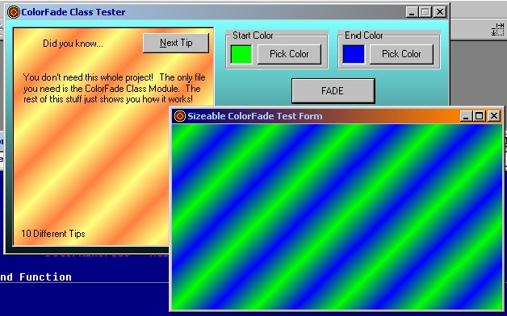

<div align="center">

## ColorFade Class


</div>

### Description

This is a class module that will return a midpoint color between a start and end color. You specify the start color, end colors, and a percentage to find out what color falls in between. A method is included to draw gradients on a form or picture box.

This is a standalone class module. A project is included for testing the class, but you only need the class module in your final code.
 
### More Info
 
Supply a start and end color as a long number, probably using the built-in RGB() function. When you are ready to find a midpoint color, supply a percentage. 0% is the start color and 100% is the end color. If you want to use form or picture gradients, you need to supply the object name.

Comes with an excellent project to demonstrate the class, but all you need is the class itself. Simply include the class module with your application and your there! Fairly small footprint.

Returns a long number specifying the in-between number. This uses the individual Red, Green, and Blue channels, not the finished long number to determine, so you get a "perfect" fade. For form and picture gradients, the drawing is done automatically using the built in Line()-() method.

Frames do not look good on top of a gradient. It is recommended that you draw your frame inside of a picture box. Also, you will have to turn on the auto-redraw of the form or picturebox.


<span>             |<span>
---                |---
**Submitted On**   |2004-05-14 22:22:54
**By**             |[Brian Zablocky](https://github.com/Planet-Source-Code/PSCIndex/blob/master/ByAuthor/brian-zablocky.md)
**Level**          |Beginner
**User Rating**    |5.0 (45 globes from 9 users)
**Compatibility**  |VB 6\.0
**Category**       |[Miscellaneous](https://github.com/Planet-Source-Code/PSCIndex/blob/master/ByCategory/miscellaneous__1-1.md)
**World**          |[Visual Basic](https://github.com/Planet-Source-Code/PSCIndex/blob/master/ByWorld/visual-basic.md)
**Archive File**   |[ColorFade\_1745745152004\.zip](https://github.com/Planet-Source-Code/brian-zablocky-colorfade-class__1-53757/archive/master.zip)

### API Declarations

```
'
'No API usage. Globals in the test project are for the test project only.
'
```


